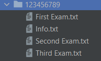

# ECT Project

A flutter application that will be used to diagnose students and analyze data. 
This application consists of three thinking exercises; each exercise tests the student's abilities from different aspects. 
The application saves the participant's data and analyzes the results.

- [ECT Project](#ect-project)
  - [First Exam](#first-exam)
  - [Second Exam: Double game](#second-exam-double-game)
  - [Application outputs](#application-outputs)

## First Exam

**Exam explanation :**  
In this exam, an "open" shape appears for several milliseconds (right side shape or left side shape).

right side
 left side

As soon as the time period has expired, the form is replaced with a "complete" form.

 complete form

The user will be required to select which direction of the shape he saw before the shape changed. 
In each round we save the time the image was displayed (milliseconds) and the correctness of the answer for each round.

If the user makes the correct choice, he will be presented with the choice again, but the amount of time he is exposed to it will decrease. 
In the event that the user answered the question incorrectly, the time will increase and the exam will continue.

## Second Exam: Double game

**Exam explanation :**  
During the exam, the user is presented with two cards that have only one symbol in common. 
The user must identify the common symbol and press on it as quickly as possible. 
In each round we save identification time.

## Application outputs

As soon as the user completes all the exams, the application creates a folder whose name is the user's ID, containing four files that include user information and their exam results. 

